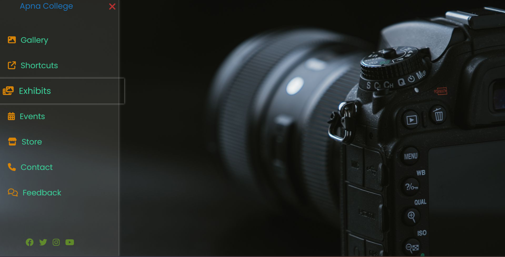

# 📸 Photography Portfolio

This is a simple and responsive photography portfolio website built using **HTML and CSS**.  
The project showcases a collection of photographs with a clean layout and modern design.

This project was created to practice frontend fundamentals like layouts, styling, and responsiveness.

## ✨ Features

- Clean and minimal photography layout
- Responsive design for different screen sizes
- Image gallery showcase
- Animated sidebar navigation
- Smooth CSS transitions and hover effects
- Interactive menu and visual feedback on user actions
- Simple and elegant UI focused on photography

---

## 🛠️ Tech Stack

- HTML5
- CSS3

---

## 📸 Screenshots

## 🌱 Future Improvements
- Add JavaScript for advanced interactivity
- Lightbox view for images
- Contact form functionality
- Performance optimization

## Author

Vaibhav Tiwari
Frontend Web Development Learner

